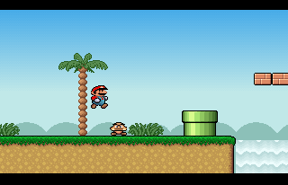



## Super Mario \(demo\)

### Description

This is My attempt on creating a Super Mario scrolling platform game. It's only 380 lines of code.

Only one level (Level Editor Included).

collision detection with the background is working (enemy's collision detection is somewhat buggy).

Poorly commented as i didn't plan to submit it.

6 Standalone modules to help you get a kick in making a game of your own.

I intend to write a guide on how to make such games, but as i am watching vb6 dieing i get discouraged.

Original game and graphics by Mike Wiering (Turbo Pascal)
 
### More Info
 

             |
---                |---
**Submitted On**   |2006-04-16 15:22:12
**By**             |[Lefteris Eleftheriades](https://github.com/Planet-Source-Code/PSCIndex/blob/master/ByAuthor/lefteris-eleftheriades.md)
**Level**          |Advanced
**User Rating**    |5.0 (45 globes from 9 users)
**Compatibility**  |VB 6\.0
**Category**       |[Games](https://github.com/Planet-Source-Code/PSCIndex/blob/master/ByCategory/games__1-38.md)
**World**          |[Visual Basic](https://github.com/Planet-Source-Code/PSCIndex/blob/master/ByWorld/visual-basic.md)
**Archive File**   |[Super\_Mari2002326232006\.zip](https://github.com/Planet-Source-Code/lefteris-eleftheriades-super-mario-demo__1-65748/archive/master.zip)

